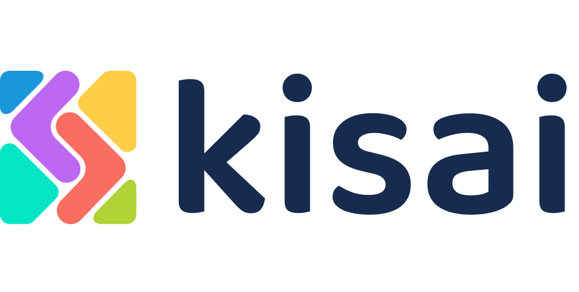

### 

### &nbsp; <h2 >About me</h1>

 - I am Mohammed Faizan, learning Full Stack Web Development in MERN Stack. I am currently in the final year of my Computer Science Engineering Course. I live in Hyderabad, India.
 - My Interest in exploring various Designs in Websites has brought me into Web Tech Domain. I love to design Frontend. I'm Determined in developing new things by collaborating in Teams and communities. Hooked in exploring Trends in Technologies and apart from that I'm interested in World Politics too.
 - I have worked on various Projects build on MERN Stack that helped me gain understanding in Web and now I am currently focusing on Frontend Technology. I am DESIGN enthusiast and I also Design User Interfaces( UI ) on Figma.
 - I am looking out for opportunities to learn-relearn skillsets in Web dev and open to participate in Projects.
 - I am currently learning VueJS and Tailwind CSS because I find it quite easy and to add up to my skill set.

 ### &nbsp; <h2> Experience </h2>  
 
  <h3>Kisai</h3>
 
 - Intern at India's Largest Incubation Center here in Hyderabad.
  &nbsp;
 - Front End Developer in Vue JS and Tailwind CSS.
 - Building Project on Ticket System 
 
  
  <h3>Code For India </h3>
  - Scholar at Code For India Foundation (Cohort A22) where I learned Web Development in MERN Stack where I have built   &nbsp;
 Projects like Font Converter, Github Search Engine, Book Management System, Task Management &nbsp;   Application etc 
   &nbsp; 
  - Participated in various interstate and national Hackathons online and offline.  
  - Attended Events and meetups related to Web3 and Design.  

## &nbsp; <h2> My Skill Set   </h2>  
<table><tr><td valign="top" width="50%">

### Frontend  

  
  
  
  
  
  
  
  
  
  
  
  
  

</td><td valign="top" width="50%">

### Backend  

  
  
  
  
  
  
  
  
  

</td></tr></table>  

   

### &nbsp; <h2 >Connect with me </h2>
 

<a href="https://www.linkedin.com/in/mohammed-faizan-8390931aa/" target="_blank">

  

 

<h2> Mail to : </h2> <a href="faizanoic.com@gmail.com">faizanoic.com@gmail.com</a>  
&nbsp;

<!-- ### &nbsp;<h2>Github Stats</h2> -->

<!-- 

   -->

<!--    -->
 <h2>Stats :</h2> &nbsp;
   
  

   
