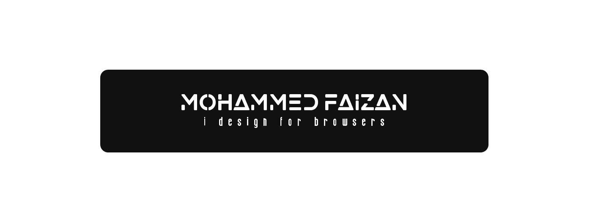

### 

### &nbsp; <h2 >About me</h1>

 - I am Mohammed Faizan, learning Full Stack Web Development in MERN Stack. I am currently in the final year of my Computer Science Engineering Course. I live in Hyderabad, India.
 - My Interest in exploring various Designs in Websites has brought me into Web Tech Domain. I love to design Frontend. I'm Determined in developing new things by collaborating in Teams and communities. Hooked in exploring Trends in Technologies and apart from that I'm interested in World Politics too.
 - I have worked on various Projects build on MERN Stack that helped me gain understanding in Web and now I am currently focusing on Frontend Technology. I am DESIGN enthusiast and I also Design User Interfaces( UI ) on Figma.
 - I am looking out for opportunities to learn-relearn skillsets in Web dev and open to participate in Projects.

 ### &nbsp; <h2> Experience </h2>
 - I was a Scholar at Code For India Foundation where I learned Web Development in MERN Stack. I have built Projects using React, NodeJS and MongoDB. 

### 🛠 &nbsp;Technologies and Tools

&nbsp;
&nbsp;

&nbsp;

&nbsp;
&nbsp;

&nbsp;
&nbsp;

### &nbsp; <h2>Projects </h2?>

### &nbsp; <h2>Communities </h2?>

### 📫 &nbsp; <h2>Connect with me </h2>

 &nbsp;
 &nbsp;
 &nbsp;

### &nbsp;<h2>Github Stats</h2>